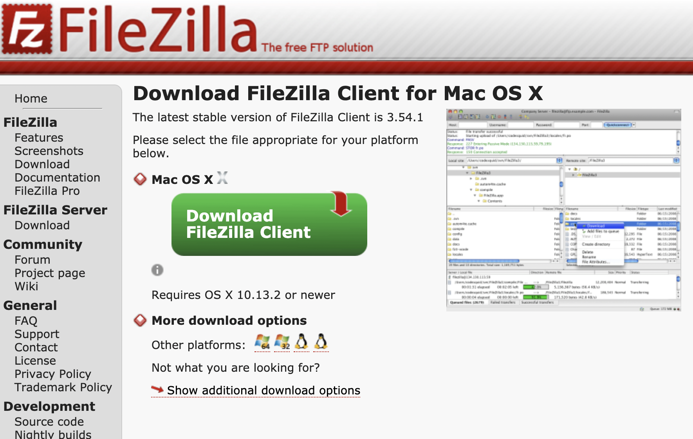
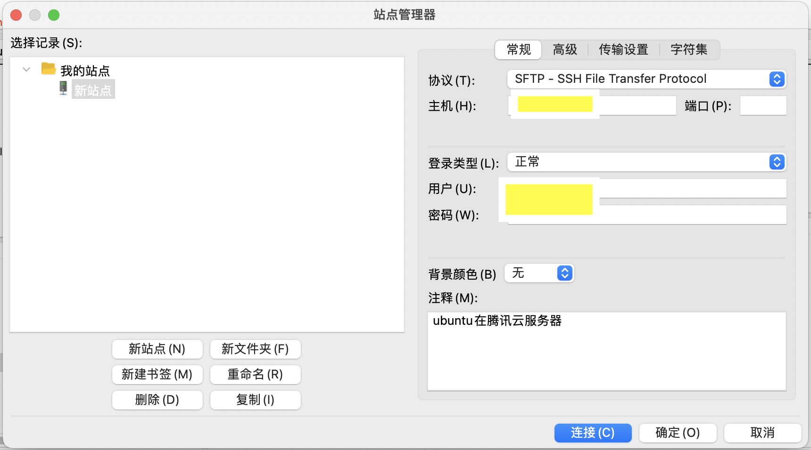

# 网站上线

操作背景：

- MacOS m1芯片（本地电脑）
- ubuntu（云服务器）

| 使用/涉及的软件    | 主要用途                                                     | 安装位置          |
| :----------------- | ------------------------------------------------------------ | ----------------- |
| next.js（node.js） | 编写网站程序                                                 | 本地电脑&云服务器 |
| VS code            | 文本编辑器                                                   | 本地电脑          |
| FileZilla          | 文件上传                                                     | 本地电脑          |
| MacBook 终端       | 远程连接云服务器                                             | 本地电脑          |
| Nginx              | 使远程运行的网站，可以在任何地方用域名访问（免除地理上的限制） | 云服务器          |
| Pm2                | 保持网站24小时可访问状态，即便关闭远程连接（免除时间上的限制，即关闭本地电脑后，依旧可以访问该网站） | 云服务器          |
| yarn或npm          |                                                              |                   |


**前言：**

前端小白一枚，学习笔记普及一篇。文章语言通俗化，方便小白食用☕️，如果有词不达意、引起歧义的地方，还请各路大神及时指出。


**简介：**

使用next.js在腾讯云服务器上成功部署、托管个人博客网站。学习笔记系列，希望帮助自己之后回顾复习，也希望可以帮助到和我一样的node.js小白。

<!-- truncate -->


## 操作步骤

1. 编写next.js文件，并在本地成功运行；
2. 文件上传到云服务器（前提是你要有一个*服务器*[手动狗头.jpg]）；
3. 远程连接到云服务器；
4. 部署next.js；
5. 安装Nginx，使网站可以在本地电脑被访问，但是在云服务器上运行；
6. 安装Pm2，使网站任何时候可以被访问，即便断开与服务器的连接。
7. 恭喜🎉，你已经成功上线一个网站。

---

下面是具体的操作步骤：

### 1.编写Next.js

操作位置：本地电脑

📖 文献参考：Next官方快速指引https://www.nextjs.cn/docs/getting-started

✅ 成功标志：本地浏览器成功访问http://localhost:3000

#### 步骤：

1. 打开你心爱的电脑；
2. 选一个顺眼的地方，新建一个文件夹📁；
3. 打开Next官方快速指引https://www.nextjs.cn/docs/getting-started，跟随官网指引搭建并且可以在本地浏览器成功访问http://localhost:3000；
4. 好了现在我们的网站已经整装待发🚢，可以把“包裹“发往“服务器”了，即”文件上传“。

> Note：结束MacOS终端后，浏览器无法访问http://localhost:3000，这是正常现象。别心急。

> 作者逼逼叨碎碎念：官网的快速指引很简单，大概5分钟搞定。但是之后为了丰富网站功能，还是花了很多功夫去学习官网的技术文档、完善网站。


### 2. 文件上传

>  现在网站包裹已经准备好了，需要选择一个顺眼的”交通工具“，有很多方式：使用电脑命令行、Xshell、FileZilla等。

🔧 软件/工具：FileZilla

✅ 成功标志：文件从本地电脑上传到云服务器，即买家收到卖家包裹。


#### 步骤

1. 下载：FileZilla（for MacOS 客户端) https://filezilla-project.org/download.php?type=client

   

2. 打开FileZilla，建立远程连接到云服务器

   1. 打开FileZilla

   2. 点击左上角第一个图标，显示如下，输入相关信息后，点击连接即可成功登陆

      

   3. 具体不知道是哪些信息、感到困惑的童鞋，可以参考MDN上的SFTP教程，讲的很详细https://developer.mozilla.org/en-US/docs/Learn/Common_questions/Upload_files_to_a_web_server

   

   ### 3.远程连接云服务器

   > 现在需要切换成买家视角--云服务器视角，即连接服务器终端。

   🔧 工具：MacOS 终端

   前提：购买云服务器，e.g. 腾讯云、阿里云等

   #### 步骤：

   1. 打开terminal；
   2. 输入`ssh 用户名@公网IP`

   > 用户名 是在购买服务器时登记的用户名，公网IP 是云服务器购买成功后获得的一个公网IP地址（数字串XX.XX.XXX.XXX)。 

   1. 输入服务器登录密码；
   2. OK，成功进入服务器视角。

   

   ### 4.部署next.js

   > Next.js程序需要一个支持他的环境才能很好的运行，就像移植的植物🌳需要一个搭建一个适合的生长环境才能茁壮成长！没错我们现在就开始“搭大棚”。[手动狗头.jpg]

   📖 文献参考：next.js官网部署指南https://www.nextjs.cn/docs/deployment

   ✅ 成功标志：上传的next.js网页（http://localhost:3000）在云服务器上可以被访问

   

   #### 软件：

   检查是否有以下软件/包，如果没有需要下载

   1. Node.js 10.13 或更高版本

      1. 方法一：使用安装包下载
      2. 方法二：在命令行用包管理器brew下载(for MacOS)

      ```shell
      brew install node
      # Homebrew 是官网认为最简单便捷的方法
      # 也可使用curl、Macport、pkgsrc。
      ```

      1. 方法三：在命令行用包管理器下载（for Linux & Windows）https://nodejs.org/en/download/package-manager/

   2. npm或yarn（但是在我的m1 air电脑上yarn指令没npm好用，不知道为什么）

   3. 如果 报错没有next，可以尝试安装next、react、react-dom这3个包。

   ```shell
   npm install next react react-dom
   # or
   yarn add next react react-dom
   ```

   

   #### 步骤：

   1. 进入上传的文件的文件夹`cd /home/.../...`；
   2. 下载安装以上提到的软件，检查版本；
   3. 更改package.json脚本，引用官网指南：

   > Next.js可以被部署到任何支持node.js的托管供应商处，要确保你的 `package.json` 文件中设置了 `"build"` 和 `"start"` 脚本：
   >
   > ```json
   > {
   >   "scripts": {
   >     "dev": "next",
   >     "build": "next build",
   >     "start": "next start"
   >   }
   > }
   > ```

   1. 在命令行执行`next build`，再执行`next start`

### 5.安装Nginx、PM2

📖 文献参考：ubuntu官网安装Nginx指南https://ubuntu.com/tutorials/install-and-configure-nginx#2-installing-nginx

 (温馨提示：如果是第一次使用nginx的超级萌新，比如我自己咳咳咳，建议先把官网指南通读、快速过一遍)

✅ 成功标志：远程运行的网站，可以在任何地方用域名访问（免除地理上的限制）


#### 步骤：

1. 安装Nginx（第一次使用）

```shell
sudo apt update
sudo apt install nginx
```

​	（optional）如果之前有下载过，需要启动、重启的：

```shell
sudo service nginx start
# start nginx
sudo service nginx stop
# stop nginx
sudo service nginx restart
# restart nginx
```

>  	参考文章https://www.cyberciti.biz/faq/nginx-restart-ubuntu-linux-command/

2. 安装PM2

```shell
yarn global add pm2
# yarn 安装PM2
pm2 --version
# 检查pm2的版本/是否成功安装
```

3. 起飞！

> 现在安装好了Nginx和PM2，接下来可以准备起飞了！

```shell
pm2 start npm --name "next" -- start
# 使用npm启动pm2，因为在这里yarn命令遇到一些问题，所以使用了npm；
# 此处的“next“是名字、可以自定义，会在下面的show命令中显示。
pm2 show next
# 此处的next即”next“，可更改。
```

